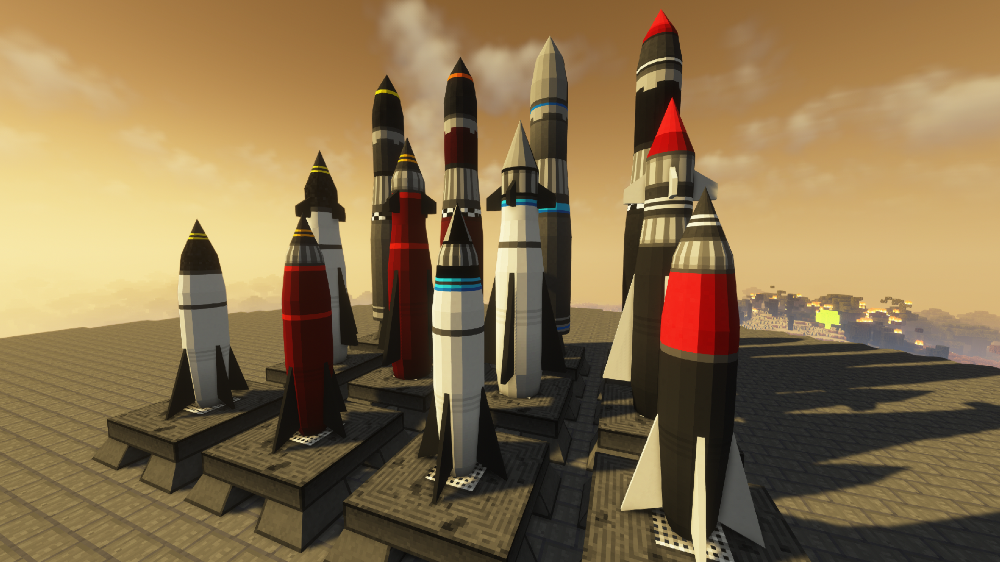
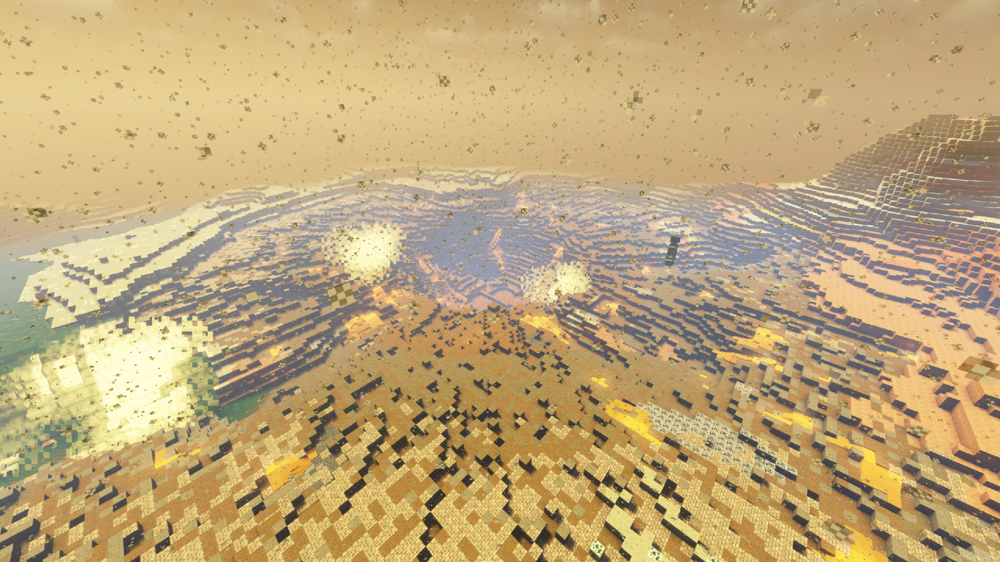

 

This mod is about building nuclear reactors, rockets, nukes, weapons and bunkers. 
It is based on the awesome work of Alcater, Drillgon and HBM. 
Due to the amount and complexity of the recipes of this mod, JEI is strongly recommended. 

This mod is, as the name implies, all about technology, atomic science and nuclear weapons. 
It features an expansive tech tree of various processing and utility machines, craftable bombs and missiles, guns, and abandoned structures to explore. 
No longer are nukes just green TNT blocks - you will have to synthesize new types of explosives and enrich uranium before you can send nuclear missiles towards your pals. 

This is the edited version of Alcater's custom version of HBM's NTM mod. 
The latest version can be found on Curseforge, Modrinth, and here but you have to build it though. 
The licence for this project can be found in the LICENSE.MD file 

 
 
 

This mod doesn't aim to add any useful features, just some stuff that me and my friends found funny. 

**Changes:**

> - Edited mcmod.info so its easier to read.
> - Edited pack.mcmeta
> - Edited Logo picture.
> - Replaced FaszomHBM Bombs background with the Hiroshima Fat Man bomb.
> - Edited coal dust death message.
> - Edited asbestos death message.
> - Edited meteor death message.
> - Edited radiation death message.
> - Renamed "Balefire" to "Béltűz"
> - Renamed all "Corium" to "Faszom-Corium"
> - Renamed "Baleonitite" to "Baletonit" because we kept mispronouncing it.
> - Replaced cough and vomit sounds to my friend's sounds.
> - Added song "Where Is My Mind" by Pixies.
> - Added song "Where Is My Mind Retrowave Remix" by The Motion.
> - Added song "The Perfect Girl" by Mareux.
> - Added song "The Perfect Girl Retrowave Remix" by The Motion.
> - Edited en_US.lang file to fix some grammatical mistakes, but there are still some.

 
 
  
  

 
 
  

This mod is forked from [Alcater's](https://github.com/Alcatergit/Hbm-s-Nuclear-Tech-GIT) fork
which is forked from the fork made by [TheOriginalGolem](https://github.com/TheOriginalGolem/Hbm-s-Nuclear-Tech-GIT)
which is forked from the port made by [Drillgon200](https://github.com/Drillgon200/Hbm-s-Nuclear-Tech-GIT)
which is ported from the original mod made by [HBMTheBobcat](https://github.com/HbmMods/Hbm-s-Nuclear-Tech-GIT).

**Other help:** 
**Sten89:** Playtester. 
**GB_Doge_9000:** Playtester. 
**Hoboy:** Textures and Models. 
**Doctor17:** Russian Translations. 
**grangerave, rodolphito, mexikoedi:** Log spam fix. 
**Crowbar Collective:** Gluon Gun sounds. 
**70000HP:** MIRV and configs. 

 
 
 

Download the repository, then open a shell prompt in that folder, then type the following:

`.\gradlew build`

Press enter. 
Now just wait for the build to finish and the new Jar file will be in `faszomhbm\build\libs`.